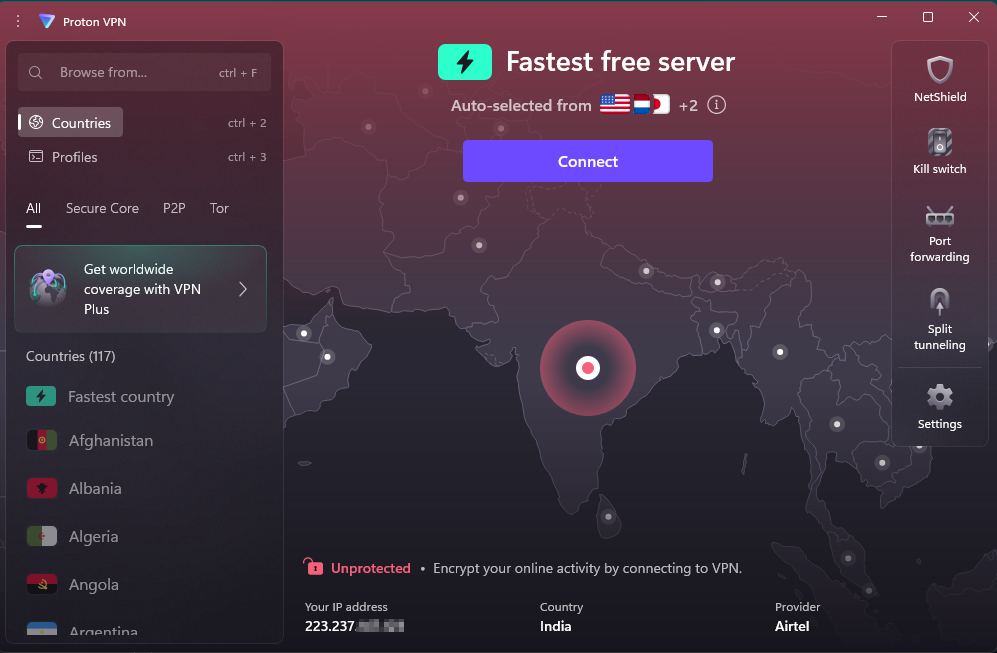
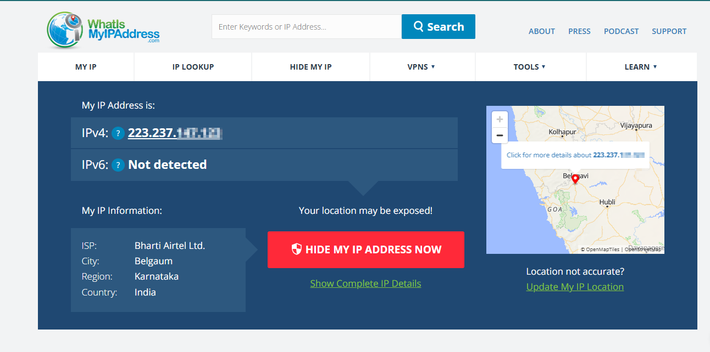
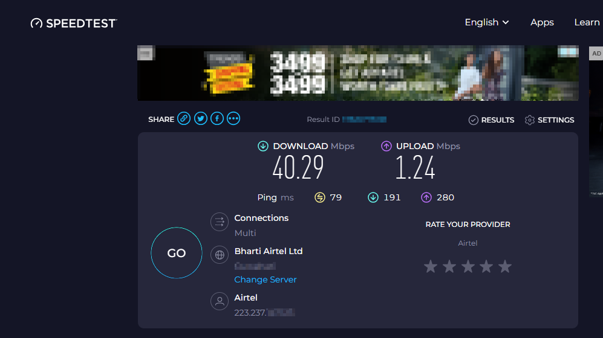
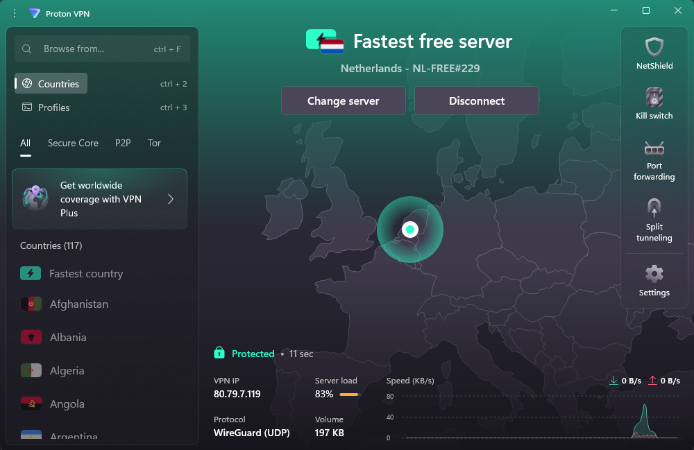
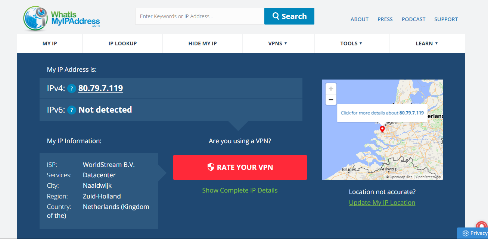
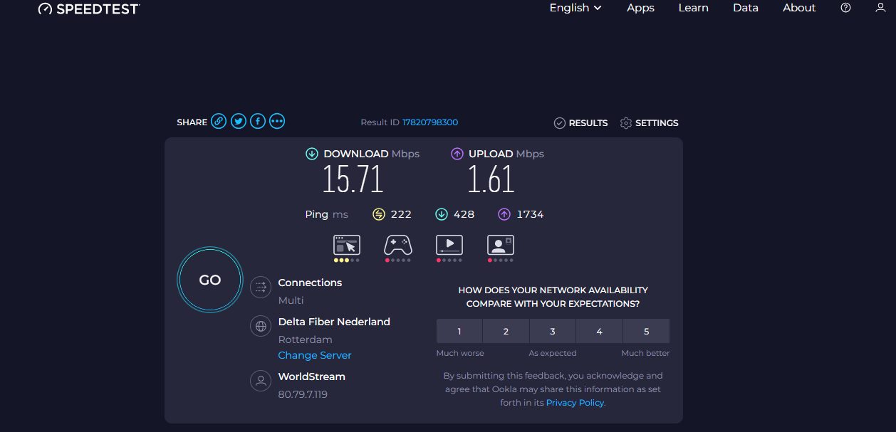
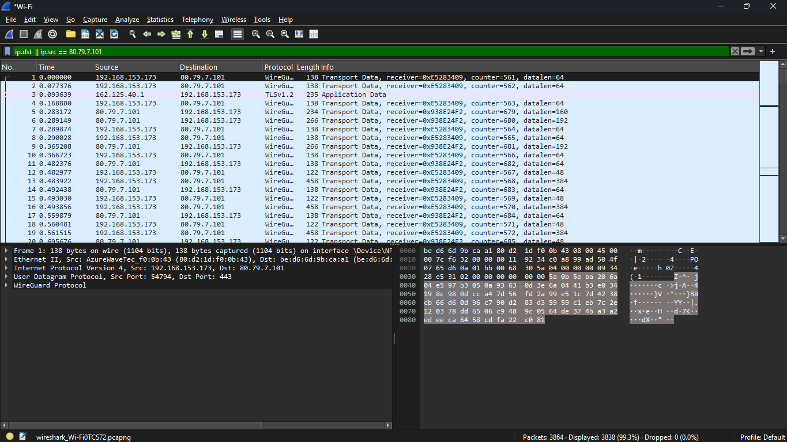

# VPN Setup and Verification Procedure

This document outlines the step-by-step process followed to configure and test a VPN connection using ProtonVPN, along with IP verification and speed test.

---

## Step-by-Step Procedure

### 1. Installed and Set Up ProtonVPN
- Downloaded the **ProtonVPN** client from the official website.
- Created a free-tier account.
- Logged in to the VPN client.

Screenshot:

---

### 2. Checked My Real IP Before VPN
- Visited [https://whatismyipaddress.com](https://whatismyipaddress.com).
  
  Screenshot:
  

- IP was shown as located in **Belgaum, Karnataka, India**.
- ISP: **Bharti Airtel Ltd.**

---

### 3. Perform Speed Test Before VPN
- Used [https://speedtest.net](https://speedtest.net) to record internet speed.

  Screenshot:
  

- Download Speed: **40.29 Mbps**
- Upload Speed: **1.24 Mbps**
- Ping: **79 ms**

---

### 4. Connect to VPN

  Screenshot:
  
  
- Connected to the **fastest free server**: Netherlands - NL-FREE#229.
- Connection protocol: **WireGuard (UDP)**.
- Status changed to: **Protected**.

---

### 5. Verify New IP After VPN
- Revisited [https://whatismyipaddress.com](https://whatismyipaddress.com).

  Screenshot:
  
  
- New IP was shown as located in **Naaldwijk, Zuid-Holland, Netherlands**.
- ISP: **WorldStream B.V.**

---

### 6. Perform Speed Test After Connecting To VPN
- Again used [https://speedtest.net](https://speedtest.net) to record internet speed.

  Screenshot:
  

- Download Speed: **15.71 Mbps**
- Upload Speed: **1.61 Mbps**
- Ping: **222 ms**

---

### 7. Used Wireshark To Capture and Analyze Traffic

  Screenshot:
  

- Used filter `ip.dst || ip.src == 80.79.7.101` to analyze traffic only coming from and to specific IP.
  (**Note:** I reconnected to VPN that's why my ip is changed here)

---

## Observations

- The IP address changed from **India** to **Netherlands**, confirming VPN tunneling worked.
- Encryption via **WireGuard** protocol ensures strong privacy.
- Expected minor internet speed reduction post-VPN.

---
